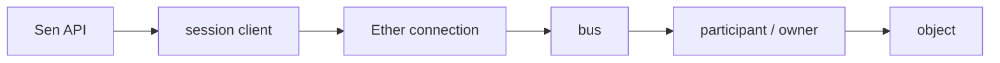

# Architecture

`sen-ether-client` is a direct Sen Ether participant implemented in Node.js. It
speaks the native process, bus and runtime protocols; it is not a JSON gateway.

## Layers

1. `lib/sen.js` is the high-level facade. It coordinates session discovery,
   connection replacement and the stable public API.
2. `lib/sen-bus.js`, `lib/sen-interest.js` and
   `lib/sen-remote-object.js` own high-level bus state, visible collections and
   typed remote-object behavior. `lib/sen-publications.js` preserves local
   publications across reconnects; `lib/change-batcher.js` owns backpressure.
3. `lib/client.js` owns discovery sockets, process connections and frame
   routing. `lib/local-buses.js`, `lib/local-publications.js` and
   `lib/remote-requests.js` isolate bus lifecycle, JavaScript publication and
   owner-scoped pending-request invariants without hiding the hot routing path.
4. `lib/codec.js` handles the Ether envelope. The stable `lib/bus.js` facade
   exposes codecs split into `lib/bus-control.js`, `lib/bus-runtime.js` and
   `lib/bus-type-spec.js`. `lib/values.js` handles typed property values, while
   `lib/limits.js` validates remote lengths and counters before allocating work.
5. `lib/ether-network.js` contains socket-free identity, endpoint and multicast
   calculations. `lib/local-objects.js` contains transport-free local object
   construction and state encoding.
6. `lib/stl.js`, `lib/stl-node.js` and `lib/fom.js` load type definitions.
   Resolved TypeSpecs are cached per bus and owner context.

The internal modules use direct ESM imports and plain maps/sets. There is no
dependency-injection framework or generic service layer. Small coordinator
classes exist only where they own durable state or enforce a protocol
invariant; `lib/bus.js` is a zero-wrapper export facade.

## Discovery and transport

Discovery can use Sen multicast or a TCP discovery hub. Discovery produces
process endpoints; normal control traffic then uses framed TCP. Native bus
multicast is a separate, optional transport for messages whose declared mode is
multicast. Setting `multicastDiscovery: false` and `busMulticast: false` makes a
topology TCP-only.

Each TCP frame has a category byte and a 32-bit payload length. The announced
length is checked before the client waits for or accumulates its body. A bad
frame closes only its connection. Datagram decode errors are reported and the
process continues.

## Sessions, buses and ownership

A root `Sen` may discover several sessions. Each session has its own
`EtherClient`; each bus has a local participant and zero or more remote
participants. A local JavaScript participant can consume and publish objects.

The bus owner coordinates participants but is not necessarily the producer of
an object. Routing therefore retains connection, participant/owner ID and
connection generation. Object identity is `(ownerId, objectId)`, never only
`objectId`. `ObjectsPublished` establishes that identity and requests missing
types and state from the announcing owner.

`TypesInfoResponse` and `ObjectsStateResponse` are matched against pending
requests created for the same connection, generation and owner. Forwarding in a
star topology records the provider and interested consumers; messages are not
broadcast indiscriminately between connections.

## Interests and object state

An interest has a query ID, owner set and live object collection. Publication,
removal, state and runtime update messages update that collection. State that
arrives before its TypeSpec is retained in a bounded per-object queue and is
decoded after type resolution. Runtime events are deduplicated by owner and
event identity.

Individual changes are the compatibility default. Optional batching has a
bounded queue, coalescing and one of `drop-oldest`, `drop-newest` or `error`
backpressure policies.

## Local publications and reconnect

Publication records retain their descriptor, types and persistent
`SenPublishedObject` handle. On reconnect the client replaces the transport,
rejoins buses, restarts existing interests and republishes local objects once.
Old remote objects become stale and are not reused as current state.

## Invariants

- A state response can satisfy only a request sent to that object's owner.
- A type response is associated with the correct connection and owner.
- A response from a replaced connection generation cannot complete an old
  request.
- The same `ObjectId` may exist under different owners.
- Recreating an interest does not reuse its previous state request.
- Restarting an interest is idempotent from the caller's perspective.
- Traffic is forwarded only along recorded routes, not to every connection.
- Closing one malformed or over-limit peer does not close healthy peers.
- Timers, pending calls and object visibility are cleared when their owning
  connection or interest ends.

## `sen-ether-client` and `@sen/client`

`sen-ether-client` speaks Ether directly, runs on Node.js and can act as a Sen
participant without a JSON-RPC component. `@sen/client` uses JSON-RPC over
WebSocket through a gateway and supports browser as well as Node.js clients.
The gateway API is convenient for web applications; direct Ether is useful for
installations without that component and for JavaScript publishers. Neither is
a universal replacement for the other.
